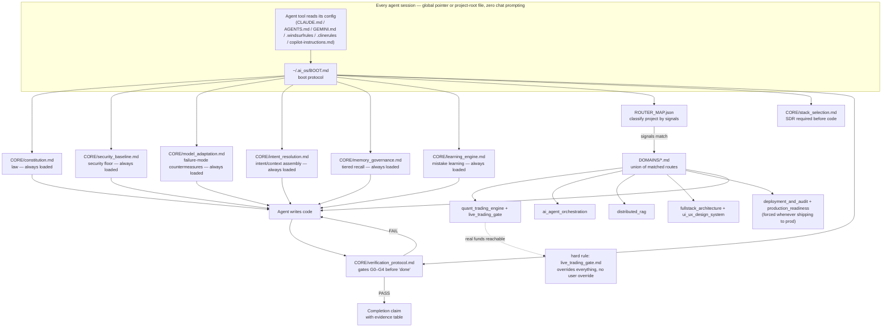

<div align="center">

# AEQ-OS

**AI Engineering & Quant Operating System**

A model-agnostic instruction layer that makes coding agents behave like institutional engineers — on quant trading systems, AI agent orchestration, RAG pipelines, and the full-stack platforms around them.

[](https://github.com/Aditya-7117/AEQ-OS/actions/workflows/validate.yml)
[](LICENSE)
[](docs/ARCHITECTURE.md#rule-index)
[](#installation)

</div>

---

## The problem

LLM coding agents are fast and confident, and neither of those is the same as correct. Left to their own defaults, they placeholder-stub hard parts, claim completion without running anything, silently swallow errors, and reach for `float` for money. That's an annoyance in a CRUD app. It's a production incident in a trading engine, and it's an invisible one in an AI agent's budget logic or an RL reward function.

AEQ-OS is not a linter and not a framework. It's a **portable rulebook**, written for agents to load and follow, that closes those failure modes with mechanical, greppable rules instead of vibes — and routes the *right* subset of rules to each project automatically, so a backtesting notebook doesn't inherit live-trading kill-switch requirements it doesn't need, and a live execution engine can't skip them.

## Features

- **418 rules across 22 files**, every one with a stable ID (`QT-STOP-3`, `LIVE-9`, `CONST-11`, `SEC-4`) — citable in code review, commit messages, and audits, resolvable anywhere with one `grep`. Counted and contiguity-checked by [`scripts/validate.py`](scripts/validate.py), not hand-tallied.
- **Automatic routing.** `ROUTER_MAP.json` classifies a project by keyword/dependency/path signals and loads only the relevant domain files — with a hard override that force-loads the live-trading gate the instant real capital is reachable, no matter what else matched.
- **A real quality gate, not a suggestion.** `CORE/verification_protocol.md` defines G0–G4: enumerated acceptance criteria → zero-warning static pass → failure-path/property tests → captured runtime evidence → a self-audit with a mutation spot-check. "Done" requires an evidence table, not a claim. `DOMAINS/production_readiness.md` adds a scored pre-launch audit on top for anything shipping to production.
- **A named registry of LLM failure modes** (`CORE/model_adaptation.md`) — placeholder elision, premature completion, hallucinated APIs, scope shrink, confidence inflation, sycophantic agreement, test-gaming — each bound to a specific, mechanical countermeasure, plus a banned-lexicon list a script actually checks.
- **Security as a default, not an add-on.** `CORE/security_baseline.md` is always loaded, same tier as the constitution — secrets lifecycle, authn/authz, sandboxing, data classification, supply-chain vetting, and prompt-injection framing apply to every project, not only ones a route happens to match.
- **A prompt-abstraction layer, without a daemon.** `CORE/intent_resolution.md` has the agent classify intent, assemble context, and surface assumptions before acting — so a terse request gets treated the way a fully-specified one would, with no engineered prompting required and no wire-level middleware doing it behind your back.
- **Portable, tiered memory.** `CORE/memory_governance.md` defines a four-tier (working/episodic/semantic/procedural) memory model on plain files any tool can read — with an explicit staleness rule: a recalled fact about a specific file or config is verified before it's acted on, never assumed current.
- **A Mistake Learning Engine.** `CORE/learning_engine.md` gives every gate failure and user correction a structured record — root cause, not just the fix — and promotes a mistake recurring twice into a new or tightened rule, so the rulebook itself gets sharper with use.
- **Model- and tool-agnostic.** One boot file, wired into whichever agent you're using via a single global pointer or a project-root file — Claude Code, Google Antigravity, Cursor, Windsurf, GitHub Copilot, Cline/Roo Code, Aider, or anything that reads `AGENTS.md`. No plugin, no daemon, no background process required (an opt-in, free, local-only Performance tier for faster memory/security tooling exists for anyone who wants it — see below).
- **Self-validating.** `scripts/validate.py` checks its own JSON, its own rule-ID contiguity, and its own banned-lexicon list in CI on every PR — the repo holds itself to the standard it sets for the code it governs.

## Architecture



Full diagrams (routing decision tree, rule-ID dependency graph, gate sequence) live in [`docs/ARCHITECTURE.md`](docs/ARCHITECTURE.md).

## Installation

```bash
git clone https://github.com/Aditya-7117/AEQ-OS.git
cd AEQ-OS
./install.sh          # macOS / Linux
# or, on Windows:
.\install.ps1
```

This symlinks (Windows: junctions) the repo into `~/.ai_os`, backing up anything already there. Editing the repo *is* editing your live installed OS — no separate sync step.

## Quick start

Wire it into your agent tool of choice — each is one static line, read once per session, negligible overhead. There are two ways to wire it, and both load AEQ-OS automatically, with zero chat prompting — you never type "please read BOOT.md":

**Global (per machine, covers every project you open in that tool):**

| Tool | Where | Snippet |
|------|-------|---------|
| Claude Code | `~/.claude/CLAUDE.md` | [`templates/CLAUDE.md-snippet.md`](templates/CLAUDE.md-snippet.md) |
| Google Antigravity / Gemini CLI | `~/.gemini/AGENTS.md` | [`templates/AGENTS.md`](templates/AGENTS.md) |
| Cursor | Settings → Rules → User Rules (manual paste — Cursor has no global rules *file*) | [`templates/cursor-user-rules.txt`](templates/cursor-user-rules.txt) |
| Windsurf | `~/.codeium/windsurf/memories/global_rules.md` | [`templates/windsurf-rules.md`](templates/windsurf-rules.md) |
| GitHub Copilot | GitHub → Settings → Copilot → Custom instructions | [`templates/copilot-instructions.md`](templates/copilot-instructions.md) |

**Project-root (covers anyone who opens this specific project in a compatible tool — no per-machine setup, works for a teammate's fresh clone):**

| Tool | Where | Snippet |
|------|-------|---------|
| Claude Code, Cursor, and any AGENTS.md-adopting tool | `<project>/AGENTS.md` | [`templates/AGENTS.md`](templates/AGENTS.md) — or run `scripts/adopt-project.sh <path>` to stamp it in one command |
| GitHub Copilot | `<project>/.github/copilot-instructions.md` | [`templates/copilot-instructions.md`](templates/copilot-instructions.md) |
| Windsurf | `<project>/.windsurfrules` | [`templates/windsurf-rules.md`](templates/windsurf-rules.md) |
| Cline / Roo Code | `<project>/.clinerules` | [`templates/clinerules.md`](templates/clinerules.md) |
| Aider | `<project>/CONVENTIONS.md` (via `--read` or `.aider.conf.yml`) | [`templates/aider-conventions.md`](templates/aider-conventions.md) |

**Open-source / local models** (Ollama, LM Studio, vLLM, and similar) are **not a separate integration point.** Whichever of the tools above is running the model reads the same pointer file the same way, regardless of which model backs it — AEQ-OS is plain text, so it works identically no matter what's generating the completions.

Verify it resolved:

```bash
grep -rn "QT-STOP-3" ~/.ai_os/
scripts/status.sh   # full wiring report: global pointers, project-root pointers, validator result
```

Then just work. On your next session, tell your agent what you're building — a live execution engine, a RAG pipeline, a trading dashboard — and it classifies the project and loads the matching rules on its own.

## Performance tier (opt-in)

The Lite tier above — agent-driven grep/read, on-demand checklists — is the default and is never deprecated. `scripts/perf/` adds real, opt-in local tooling for anyone who wants faster recall or scripted checks, closing `MEM-15`/`SEC-18`/`PROD-18`'s tier-awareness rules:

```bash
scripts/perf/memory_index.py build              # SQLite FTS5 index of .ai_os/memory/, zero dependencies
scripts/perf/memory_index.py search "query" --semantic   # auto-upgrades to local-embedding search if Ollama has one pulled
scripts/perf/security_scan.py                   # orchestrates whatever free scanners are already installed (bandit, npm audit, cargo-audit, gosec)
scripts/perf/readiness_check.py                 # mechanical subset of production_readiness.md's PROD-n checklist
scripts/perf/install_watcher.sh <project>        # generates a launchd/systemd unit for continuous reindexing — prints the activation command, never registers it for you
```

No paid APIs, no subscriptions, ever. An install (like a local Ollama embedding model) is fine because it's free, open-source, and something you explicitly opt into — never silent, never required. See [`scripts/perf/README.md`](scripts/perf/README.md) for full details.

## Folder structure

```
AEQ-OS/
├── BOOT.md                          agent boot loader (read this, not README, if you're an agent)
├── ROUTER_MAP.json                  project → rule-file routing, machine-readable
├── CORE/
│   ├── constitution.md              CONST-1..33 — fail-loud, type-safety, money/time law
│   ├── security_baseline.md         SEC-1..18 — secrets, authn/authz, sandboxing, data protection, supply chain
│   ├── model_adaptation.md          META-1..16 — LLM failure-mode registry + banned lexicon
│   ├── intent_resolution.md         INT-1..14 — intent/persona classification, context assembly, prompt abstraction
│   ├── memory_governance.md         MEM-1..15 — tiered memory (working/episodic/semantic/procedural), staleness rules
│   ├── learning_engine.md           LEARN-1..14 — Mistake Learning Engine: record schema, recall, pattern promotion
│   ├── stack_selection.md           STACK-1..10 — dynamic stack choice + per-stack invariants
│   └── verification_protocol.md     VER-1..12 — gates G0–G4, evidence rules
├── DOMAINS/
│   ├── quant_trading_engine.md      QT-* — concurrency, WebSocket state, trailing-stop math
│   ├── live_trading_gate.md         LIVE-1..22 — zero-tolerance live deployment checklist
│   ├── exhaustive_research.md       RESEARCH-1..20 — hypothesis-space breadth, overfitting guards
│   ├── portfolio_risk.md            PORT-1..20 — position sizing, VaR/drawdown caps, tail risk
│   ├── market_data_quality.md       DATA-1..20 — point-in-time correctness, survivorship bias, lineage
│   ├── trading_compliance.md        COMP-1..18 — audit trail, manipulation-pattern self-checks
│   ├── model_lifecycle.md           MDL-1..18 — model versioning, decay, champion/challenger
│   ├── ai_agent_orchestration.md    AGT-1..20 — budget caps, loop guards, RL state
│   ├── distributed_rag.md           RAG-1..17 — chunk lineage, multi-store sync, drift
│   ├── financial_audit_ledger.md    LGR-1..16 — dual-entry, hash-chained, CA-grade ledger
│   ├── fullstack_architecture.md    FS-1..20 — migrations, state boundaries, contracts
│   ├── ui_ux_design_system.md       UIUX-1..20 — institutional design tokens, live rendering
│   ├── deployment_and_audit.md      DEP-1..20 — zero-downtime deploys, drift, merge gates
│   └── production_readiness.md      PROD-1..18 — pre-launch institutional-grade audit, scored PASS/FLAG/BLOCK
├── scripts/
│   ├── validate.py                  CI self-check: JSON validity, rule-ID contiguity, lexicon
│   ├── status.sh                    on-demand wiring report: global + project-root pointers, validator result, Performance-tier state
│   ├── adopt-project.sh             stamps a project with an AGENTS.md pointer, one command, non-destructive
│   └── perf/                        opt-in Performance tier — see scripts/perf/README.md
│       ├── memory_index.py          SQLite FTS5 memory search, auto-upgrading to local-embedding semantic search
│       ├── security_scan.py         orchestrates already-installed free scanners (bandit, npm audit, cargo-audit, gosec)
│       ├── readiness_check.py       mechanical subset of production_readiness.md's PROD-n checklist
│       ├── watcher.py               bounded, owned polling loop — reindexes memory, periodic security scans
│       └── install_watcher.sh / uninstall_watcher.sh   generates (never auto-registers) a launchd/systemd unit
├── templates/                       drop-in snippets per agent tool
├── install.sh / install.ps1         installer (macOS/Linux/Windows)
└── docs/ARCHITECTURE.md             extended diagrams + design philosophy
```

## Usage

**Quant execution engine:** mention "trailing stop," "order router," or a venue SDK dependency, and the agent loads `quant_trading_engine.md` + `live_trading_gate.md` + `financial_audit_ledger.md` — trailing-stop math gets the monotonicity invariant (`QT-STOP-3`) and crash-safe watermark persistence (`QT-STOP-8`) for free, and nothing ships live until every `LIVE-n` item is a verified PASS.

**Agentic RAG system:** the agent loads `ai_agent_orchestration.md` + `distributed_rag.md` — budget circuit breakers, loop-progress detection, chunk lineage, and embedder-version isolation apply without you having to ask for any of them by name.

**Anything shipping to production:** `deployment_and_audit.md` and `production_readiness.md` both load regardless of route, tying deploys back to the same G0–G4 gates, requiring an isolated pre-merge deadlock/SPOF inspection before the merge tool fires (`DEP-16`), and running the pre-launch architecture/security/observability/performance audit that turns a locally-working prototype into something a scored PASS/FLAG/BLOCK report actually backs (`PROD-14`, `PROD-17`).

**A terse request in any project:** before touching code, `intent_resolution.md` classifies what you're actually asking for and which routes/personas apply, `memory_governance.md` recalls anything relevant already known about this project, and `learning_engine.md` checks whether this kind of task has bitten a prior session — none of it requires you to say more than you naturally would.

**Backtesting research:** the agent loads `exhaustive_research.md` alongside the quant domains — a literal "test this parameter" request becomes a scoped sweep of the neighborhood (`RESEARCH-1`), reported with cost/regime sensitivity bands and a negative-result table (`RESEARCH-4`, `RESEARCH-11`) instead of a single cherry-picked number, and a backtest can't be represented as live-ready until it clears the multiple-comparisons and baseline-comparison bar (`RESEARCH-17`).

**Institutional quant desk:** `quant_live_execution` pulls in the full stack — `portfolio_risk.md` caps exposure and tail risk across the whole book, not just per-strategy (`PORT-3`, `PORT-15`); `market_data_quality.md` guards against survivorship bias and look-ahead leaks in the data itself (`DATA-1`, `DATA-3`); `trading_compliance.md` is force-loaded the instant real funds are reachable and self-checks for manipulative order patterns, intentional or not (`COMP-2`); `model_lifecycle.md` governs how a strategy version gets promoted, monitored for decay, and safely rolled back (`MDL-9`, `MDL-4`, `MDL-8`).

## Roadmap

- [x] **Opt-in Performance tier** — shipped in v1.6.0, see [`scripts/perf/`](scripts/perf/) below.
- [ ] Dedicated `DOMAINS/data_engineering.md` — schema evolution and pipeline invariants beyond what `fullstack_architecture.md` covers for OLTP (distinct from `market_data_quality.md`, which is about market data specifically).
- [ ] Dedicated `DOMAINS/credential_lifecycle.md` — key rotation automation, vault integration, per-environment isolation at team scale, deeper than `security_baseline.md`'s (`SEC-1`/`SEC-2`) general-purpose baseline.
- [ ] Reference implementations: a minimal trailing-stop engine and a minimal RAG ingestion pipeline that visibly follow the rule IDs, for onboarding.
- [ ] A `--check` mode for `validate.py` that also lints cross-file rule citations (does `QT-STOP-3` actually exist where it's cited?).

## Contributing

See [`CONTRIBUTING.md`](CONTRIBUTING.md). Short version: run `scripts/validate.py`, append new rule IDs rather than renumbering, and justify every rule by the failure mode it closes.

## License

[MIT](LICENSE).

## Acknowledgements

Built against real, hard-won failure modes in agentic coding, quant execution, and financial systems engineering — not written in the abstract.

## FAQ

**Does this run anything, or slow my agent down?**
No, not by default. It's plain Markdown and JSON, read into context like any other instruction — no daemon, no process, no network calls in the Lite tier, which is what ships in this repo today. `production_readiness.md`'s `PROD-15` auto-remediation ("automatically fix what's mechanically fixable") still happens because the agent edits files during a normal session, the same way it fixes anything else you ask it to — not because a new always-on enforcement service now exists. A free, fully opt-in Performance tier (`scripts/perf/` — local search index, optional background watcher, never a paid API) exists for anyone who wants it and has the hardware; it will never be required, and the Lite tier will never be deprecated.

**Is there a dashboard to watch it working?**
Deliberately not — there's no running process, so a "live" dashboard would be showing you a fake heartbeat, which is exactly the kind of dishonest-status theater `CONST-6` and `META-2` exist to rule out elsewhere in this repo. Instead, run `scripts/status.sh`: an on-demand check of install wiring, per-tool *and* per-project pointers, `validate.py`'s result, and real evidence — a grep of your own project git history for rule-ID citations in commit messages — that the rules are actually showing up in real work, not just installed and forgotten.

**Will my agent find this automatically, or do I have to tell it to read BOOT.md every time?**
Automatically, once wired — either globally (one pointer per tool, per machine, covers every project you open from then on) or per-project (a committed `AGENTS.md` or tool-specific file at the project root, which covers anyone who opens that project, on any machine, with zero setup). Both mechanisms are ordinary files a tool reads on its own, the same way this session found `BOOT.md` without being asked to in chat. See the compatibility tables above, or run `scripts/adopt-project.sh` to stamp a project with the project-root pointer in one command.

**Does it *enforce* anything?**
It instructs. Whether an agent honors it depends on the agent — that's why `CORE/model_adaptation.md` exists: it's written for the agent reading it, naming its own likely failure modes and closing them mechanically (banned lexicon, evidence tables, mutation checks) rather than trusting good intentions.

**Why Markdown instead of a config format a program can enforce?**
Because the consumer is an LLM, not a linter — LLMs follow well-structured prose more reliably than they parse YAML schemas for behavioral rules. `scripts/validate.py` covers what *can* be mechanically checked (structure, contiguity, banned phrases); the rest is agent discipline, same as it is for a human engineer reading a style guide.

**Can I use this without the quant/trading domains?**
Yes — `ROUTER_MAP.json` only loads what a project's signals match. A pure frontend or backend project never sees `live_trading_gate.md`.

**Is this affiliated with any exchange, broker, or fund?**
No. It contains no execution code, no API keys, no strategy logic — it's an instruction set for how an agent *should* write that code, if you're building it yourself.
