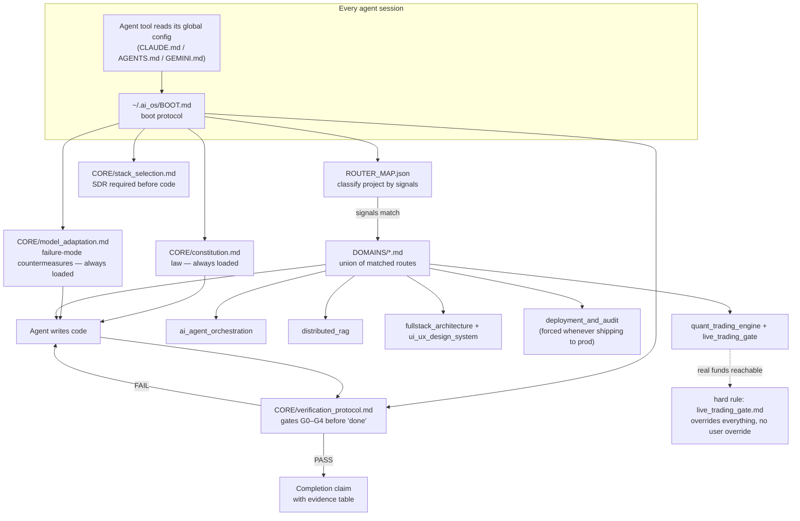

<div align="center">

# AEQ-OS

**AI Engineering & Quant Operating System**

A model-agnostic instruction layer that makes coding agents behave like institutional engineers — on quant trading systems, AI agent orchestration, RAG pipelines, and the full-stack platforms around them.

[](https://github.com/Aditya-7117/AEQ-OS/actions/workflows/validate.yml)
[](LICENSE)
[](docs/ARCHITECTURE.md#rule-index)
[](#installation)

</div>

---

## The problem

LLM coding agents are fast and confident, and neither of those is the same as correct. Left to their own defaults, they placeholder-stub hard parts, claim completion without running anything, silently swallow errors, and reach for `float` for money. That's an annoyance in a CRUD app. It's a production incident in a trading engine, and it's an invisible one in an AI agent's budget logic or an RL reward function.

AEQ-OS is not a linter and not a framework. It's a **portable rulebook**, written for agents to load and follow, that closes those failure modes with mechanical, greppable rules instead of vibes — and routes the *right* subset of rules to each project automatically, so a backtesting notebook doesn't inherit live-trading kill-switch requirements it doesn't need, and a live execution engine can't skip them.

## Features

- **242 rules across 12 files**, every one with a stable ID (`QT-STOP-3`, `LIVE-9`, `CONST-11`) — citable in code review, commit messages, and audits, resolvable anywhere with one `grep`. Counted and contiguity-checked by [`scripts/validate.py`](scripts/validate.py), not hand-tallied.
- **Automatic routing.** `ROUTER_MAP.json` classifies a project by keyword/dependency/path signals and loads only the relevant domain files — with a hard override that force-loads the live-trading gate the instant real capital is reachable, no matter what else matched.
- **A real quality gate, not a suggestion.** `CORE/verification_protocol.md` defines G0–G4: enumerated acceptance criteria → zero-warning static pass → failure-path/property tests → captured runtime evidence → a self-audit with a mutation spot-check. "Done" requires an evidence table, not a claim.
- **A named registry of LLM failure modes** (`CORE/model_adaptation.md`) — placeholder elision, premature completion, hallucinated APIs, scope shrink, confidence inflation, sycophantic agreement, test-gaming — each bound to a specific, mechanical countermeasure, plus a banned-lexicon list a script actually checks.
- **Model- and tool-agnostic.** One boot file, wired into whichever agent you're using via a single global pointer — Claude Code, Google Antigravity, Cursor, or anything that reads `AGENTS.md`. No plugin, no daemon, no background process.
- **Self-validating.** `scripts/validate.py` checks its own JSON, its own rule-ID contiguity, and its own banned-lexicon list in CI on every PR — the repo holds itself to the standard it sets for the code it governs.

## Architecture



Full diagrams (routing decision tree, rule-ID dependency graph, gate sequence) live in [`docs/ARCHITECTURE.md`](docs/ARCHITECTURE.md).

## Installation

```bash
git clone https://github.com/Aditya-7117/AEQ-OS.git
cd AEQ-OS
./install.sh          # macOS / Linux
# or, on Windows:
.\install.ps1
```

This symlinks (Windows: junctions) the repo into `~/.ai_os`, backing up anything already there. Editing the repo *is* editing your live installed OS — no separate sync step.

## Quick start

Wire it into your agent tool of choice — each is one static line, read once per session, negligible overhead:

| Tool | Where | Snippet |
|------|-------|---------|
| Claude Code | `~/.claude/CLAUDE.md` | [`templates/CLAUDE.md-snippet.md`](templates/CLAUDE.md-snippet.md) |
| Google Antigravity | `~/.gemini/AGENTS.md` | [`templates/AGENTS.md`](templates/AGENTS.md) |
| Cursor | Settings → Rules → User Rules (manual paste — Cursor has no global rules *file*) | [`templates/cursor-user-rules.txt`](templates/cursor-user-rules.txt) |
| Any AGENTS.md-compatible tool | project root | [`templates/AGENTS.md`](templates/AGENTS.md) |

Verify it resolved:

```bash
grep -rn "QT-STOP-3" ~/.ai_os/
```

Then just work. On your next session, tell your agent what you're building — a live execution engine, a RAG pipeline, a trading dashboard — and it classifies the project and loads the matching rules on its own.

## Folder structure

```
AEQ-OS/
├── BOOT.md                          agent boot loader (read this, not README, if you're an agent)
├── ROUTER_MAP.json                  project → rule-file routing, machine-readable
├── CORE/
│   ├── constitution.md              CONST-1..33 — fail-loud, type-safety, money/time law
│   ├── model_adaptation.md          META-1..16 — LLM failure-mode registry + banned lexicon
│   ├── stack_selection.md           STACK-1..10 — dynamic stack choice + per-stack invariants
│   └── verification_protocol.md     VER-1..12 — gates G0–G4, evidence rules
├── DOMAINS/
│   ├── quant_trading_engine.md      QT-* — concurrency, WebSocket state, trailing-stop math
│   ├── live_trading_gate.md         LIVE-1..22 — zero-tolerance live deployment checklist
│   ├── ai_agent_orchestration.md    AGT-1..20 — budget caps, loop guards, RL state
│   ├── distributed_rag.md           RAG-1..17 — chunk lineage, multi-store sync, drift
│   ├── financial_audit_ledger.md    LGR-1..16 — dual-entry, hash-chained, CA-grade ledger
│   ├── fullstack_architecture.md    FS-1..20 — migrations, state boundaries, contracts
│   ├── ui_ux_design_system.md       UIUX-1..20 — institutional design tokens, live rendering
│   └── deployment_and_audit.md      DEP-1..20 — zero-downtime deploys, drift, merge gates
├── scripts/validate.py              CI self-check: JSON validity, rule-ID contiguity, lexicon
├── templates/                       drop-in snippets per agent tool
├── install.sh / install.ps1         installer (macOS/Linux/Windows)
└── docs/ARCHITECTURE.md             extended diagrams + design philosophy
```

## Usage

**Quant execution engine:** mention "trailing stop," "order router," or a venue SDK dependency, and the agent loads `quant_trading_engine.md` + `live_trading_gate.md` + `financial_audit_ledger.md` — trailing-stop math gets the monotonicity invariant (`QT-STOP-3`) and crash-safe watermark persistence (`QT-STOP-8`) for free, and nothing ships live until every `LIVE-n` item is a verified PASS.

**Agentic RAG system:** the agent loads `ai_agent_orchestration.md` + `distributed_rag.md` — budget circuit breakers, loop-progress detection, chunk lineage, and embedder-version isolation apply without you having to ask for any of them by name.

**Anything shipping to production:** `deployment_and_audit.md` loads regardless of route, tying deploys back to the same G0–G4 gates and requiring an isolated pre-merge deadlock/SPOF inspection before the merge tool fires.

## Roadmap

- [ ] **Exhaustive backtesting research mode** — a domain layer that pushes a research agent past literally testing what was asked, toward systematically exploring the adjacent hypothesis space (parameter sweeps, regime splits, alternate cost models) before calling a backtest result meaningful. Highest-value near-term addition; tracked in [issues](https://github.com/Aditya-7117/AEQ-OS/issues).
- [ ] Dedicated `DOMAINS/data_engineering.md` — schema evolution and pipeline invariants beyond what `fullstack_architecture.md` covers for OLTP.
- [ ] Reference implementations: a minimal trailing-stop engine and a minimal RAG ingestion pipeline that visibly follow the rule IDs, for onboarding.
- [ ] A `--check` mode for `validate.py` that also lints cross-file rule citations (does `QT-STOP-3` actually exist where it's cited?).

## Contributing

See [`CONTRIBUTING.md`](CONTRIBUTING.md). Short version: run `scripts/validate.py`, append new rule IDs rather than renumbering, and justify every rule by the failure mode it closes.

## License

[MIT](LICENSE).

## Acknowledgements

Built against real, hard-won failure modes in agentic coding, quant execution, and financial systems engineering — not written in the abstract.

## FAQ

**Does this run anything, or slow my agent down?**
No. It's plain Markdown and JSON, read into context like any other instruction. No daemon, no process, no network calls.

**Does it *enforce* anything?**
It instructs. Whether an agent honors it depends on the agent — that's why `CORE/model_adaptation.md` exists: it's written for the agent reading it, naming its own likely failure modes and closing them mechanically (banned lexicon, evidence tables, mutation checks) rather than trusting good intentions.

**Why Markdown instead of a config format a program can enforce?**
Because the consumer is an LLM, not a linter — LLMs follow well-structured prose more reliably than they parse YAML schemas for behavioral rules. `scripts/validate.py` covers what *can* be mechanically checked (structure, contiguity, banned phrases); the rest is agent discipline, same as it is for a human engineer reading a style guide.

**Can I use this without the quant/trading domains?**
Yes — `ROUTER_MAP.json` only loads what a project's signals match. A pure frontend or backend project never sees `live_trading_gate.md`.

**Is this affiliated with any exchange, broker, or fund?**
No. It contains no execution code, no API keys, no strategy logic — it's an instruction set for how an agent *should* write that code, if you're building it yourself.
