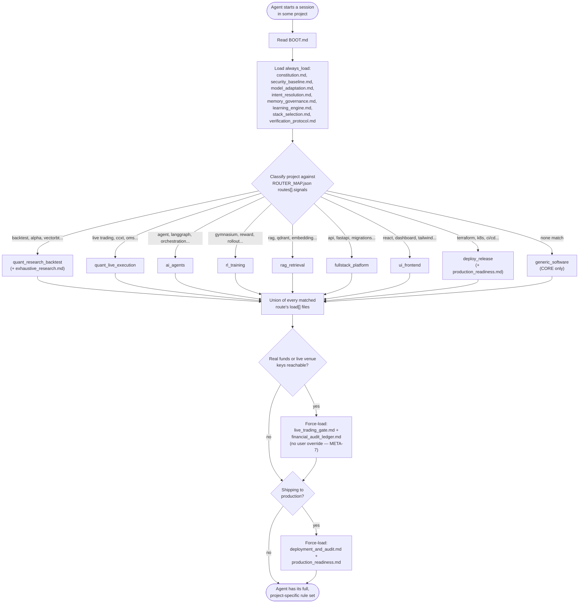
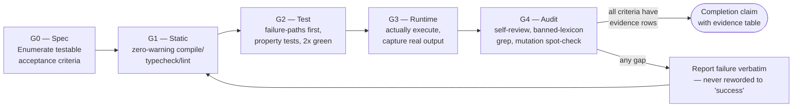
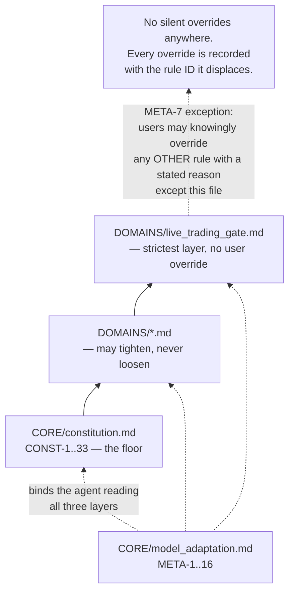

# AEQ-OS Architecture

## Design philosophy

AEQ-OS is built on one premise: **an LLM coding agent follows well-structured, ID-addressable prose more reliably than it parses a schema it's supposed to self-enforce.** So instead of building a linter that catches violations after the fact, AEQ-OS is written as the thing the agent reads *before* writing a line of code — every rule short, imperative, and citable by ID, so a violation can be named in review the same way a human would cite a style guide section.

Three structural choices follow from that:

1. **Layered, not flat.** `CORE/` is universal law; `DOMAINS/` tightens it per project type. A domain file may never loosen a constitutional rule — only add constraints on top. This means the constitution stays small and stable while domain coverage grows without risk of silently weakening the floor. `security_baseline.md`, `model_adaptation.md`, `intent_resolution.md`, `memory_governance.md`, and `learning_engine.md` all live in `CORE/` rather than `DOMAINS/` for the same reason `constitution.md` does: security, own-failure-mode awareness, intent classification, memory, and mistake-learning aren't specific to a trading engine or a RAG pipeline — they apply to every project a route could ever match, including `generic_software`, which matches none of them.
2. **Routed, not force-loaded.** Nobody wants trailing-stop math rules polluting the context of a CRUD API. `ROUTER_MAP.json` classifies a project by signal (keywords, dependencies, paths) and loads only the matching domain files — except where a hard rule overrides routing entirely (real capital reachable → `live_trading_gate.md` loads no matter what else matched).
3. **Self-auditing.** `scripts/validate.py` runs the same category of check a maintainer would do by hand — rule-ID contiguity, banned-lexicon absence, router path integrity — in CI on every PR. A rulebook that asks for rigor and doesn't hold its own structure to it isn't credible.

## Technology

There is no runtime. AEQ-OS is:

- **Markdown** for rules — because the consumer is an LLM reading prose, not a program parsing a schema.
- **JSON** for `ROUTER_MAP.json` — the one artifact a program (or an agent) needs to parse mechanically, so it gets a mechanical format.
- **Python** for `scripts/validate.py` — no dependencies beyond the standard library, so `python3 scripts/validate.py` runs anywhere Python 3.9+ exists, with no install step.
- **Bash + PowerShell** for `install.sh` / `install.ps1` — symlink (macOS/Linux) or junction (Windows) into `~/.ai_os`, so editing the repo is editing the live OS with no sync step.

No server, no database, no dependency graph beyond Python's standard library. The entire "runtime cost" of AEQ-OS is the context window an agent spends reading the files it routes to — typically a few thousand tokens, once per session.

## Routing decision flow



## Verification gate sequence



`DEP-1` ties a sixth, deployment-time gate to this sequence: nothing ships to production unless G0–G4 passed **on the exact commit SHA being deployed** — an edit after the gates ran invalidates them (`VER-12`), so the sequence re-runs from G1.

## Precedence & override graph



## Components

| File | Rule prefix | Owns |
|---|---|---|
| `CORE/constitution.md` | `CONST-n` | Fail-loud, type-safety, money/time/concurrency law — applies to every stack, every project |
| `CORE/security_baseline.md` | `SEC-n` | Secrets lifecycle, authn/authz baseline, sandboxing, data classification, supply chain, prompt-injection framing — security as a default, not a routed add-on |
| `CORE/model_adaptation.md` | `META-n` | Named LLM failure-mode registry + mechanical countermeasure per mode + banned lexicon |
| `CORE/intent_resolution.md` | `INT-n` | Prompt-abstraction layer: intent/route/persona classification and context assembly before acting, so users don't hand-engineer prompts |
| `CORE/memory_governance.md` | `MEM-n` | Portable, tool-agnostic tiered memory: working/episodic/semantic/procedural, staleness verification, token-budget-scoped recall |
| `CORE/learning_engine.md` | `LEARN-n` | Mistake Learning Engine: fixed record schema, recall-before-repeat, pattern promotion into new/tightened rules |
| `CORE/stack_selection.md` | `STACK-n` | Procedure for choosing a tech stack per project's actual parameters, not habit; per-stack invariant packs |
| `CORE/verification_protocol.md` | `VER-n` | Gates G0–G4 and the evidence-table format a completion claim must carry |
| `DOMAINS/quant_trading_engine.md` | `QT-ARCH/CONC/WS/ORD/STOP/PNL/TIME/DET-n` | Single-writer order state, WebSocket state machine, trailing-stop math, backtest/live parity |
| `DOMAINS/live_trading_gate.md` | `LIVE-n` | Zero-tolerance PASS/FAIL checklist before real capital is at risk; no override |
| `DOMAINS/exhaustive_research.md` | `RESEARCH-n` | Hypothesis-space breadth, overfitting/multiple-comparisons guards, negative-result reporting for backtesting |
| `DOMAINS/portfolio_risk.md` | `PORT-n` | Position sizing, portfolio-level VaR/drawdown caps, correlation/concentration limits, tail risk, kill-switch integration |
| `DOMAINS/market_data_quality.md` | `DATA-n` | Point-in-time correctness, survivorship-bias-free universes, corporate actions, vendor reconciliation, data lineage |
| `DOMAINS/trading_compliance.md` | `COMP-n` | Regulator-grade audit trail, manipulation-pattern self-checks, regulatory thresholds, information barriers |
| `DOMAINS/model_lifecycle.md` | `MDL-n` | Model/strategy versioning, shadow deployment, champion/challenger promotion, decay monitoring, rollback |
| `DOMAINS/ai_agent_orchestration.md` | `AGT-n` | Budget circuit breakers, loop/recursion guards, RL transition logging, multi-agent supervision |
| `DOMAINS/distributed_rag.md` | `RAG-n` | Chunk lineage, multi-vector-store sync via outbox, embedder-version isolation, injection quarantine |
| `DOMAINS/financial_audit_ledger.md` | `LGR-n` | Dual-entry, hash-chained, append-only ledger shared by trading fills and LLM spend metering |
| `DOMAINS/fullstack_architecture.md` | `FS-n` | Migration safety, stateless/stateful boundaries, outbox reconciliation, API contract safety |
| `DOMAINS/ui_ux_design_system.md` | `UIUX-n` | Institutional design tokens, data-density layout, low-latency live-data rendering |
| `DOMAINS/deployment_and_audit.md` | `DEP-n` | Zero-downtime deploy discipline, drift tracking, pre-merge deadlock/SPOF inspection |
| `DOMAINS/production_readiness.md` | `PROD-n` | Pre-launch institutional-grade audit — architecture/scalability, API security, observability, error handling, performance, backups, attack surface, compliance — scored PASS/FLAG/BLOCK, distinct from DEP's release mechanics |

## Rule index

Counted and contiguity-checked by `scripts/validate.py` — this table is regenerated from that check, not maintained by hand.

| Prefix | Rules | Defined in |
|---|---|---|
| `CONST` | 33 | `CORE/constitution.md` |
| `SEC` | 18 | `CORE/security_baseline.md` |
| `META` | 16 | `CORE/model_adaptation.md` |
| `INT` | 14 | `CORE/intent_resolution.md` |
| `MEM` | 15 | `CORE/memory_governance.md` |
| `LEARN` | 14 | `CORE/learning_engine.md` |
| `STACK` | 10 | `CORE/stack_selection.md` |
| `VER` | 12 | `CORE/verification_protocol.md` |
| `QT-ARCH` | 4 | `DOMAINS/quant_trading_engine.md` |
| `QT-CONC` | 4 | `DOMAINS/quant_trading_engine.md` |
| `QT-WS` | 6 | `DOMAINS/quant_trading_engine.md` |
| `QT-ORD` | 5 | `DOMAINS/quant_trading_engine.md` |
| `QT-STOP` | 10 | `DOMAINS/quant_trading_engine.md` |
| `QT-PNL` | 2 | `DOMAINS/quant_trading_engine.md` |
| `QT-TIME` | 2 | `DOMAINS/quant_trading_engine.md` |
| `QT-DET` | 3 | `DOMAINS/quant_trading_engine.md` |
| `LIVE` | 22 | `DOMAINS/live_trading_gate.md` |
| `RESEARCH` | 21 | `DOMAINS/exhaustive_research.md` |
| `PORT` | 20 | `DOMAINS/portfolio_risk.md` |
| `DATA` | 20 | `DOMAINS/market_data_quality.md` |
| `COMP` | 18 | `DOMAINS/trading_compliance.md` |
| `MDL` | 18 | `DOMAINS/model_lifecycle.md` |
| `AGT` | 20 | `DOMAINS/ai_agent_orchestration.md` |
| `RAG` | 17 | `DOMAINS/distributed_rag.md` |
| `LGR` | 16 | `DOMAINS/financial_audit_ledger.md` |
| `FS` | 20 | `DOMAINS/fullstack_architecture.md` |
| `UIUX` | 20 | `DOMAINS/ui_ux_design_system.md` |
| `DEP` | 20 | `DOMAINS/deployment_and_audit.md` |
| `PROD` | 18 | `DOMAINS/production_readiness.md` |
| **Total** | **418** | |

Resolve any rule ID from anywhere:

```bash
grep -rn "QT-STOP-3" ~/.ai_os/
```
